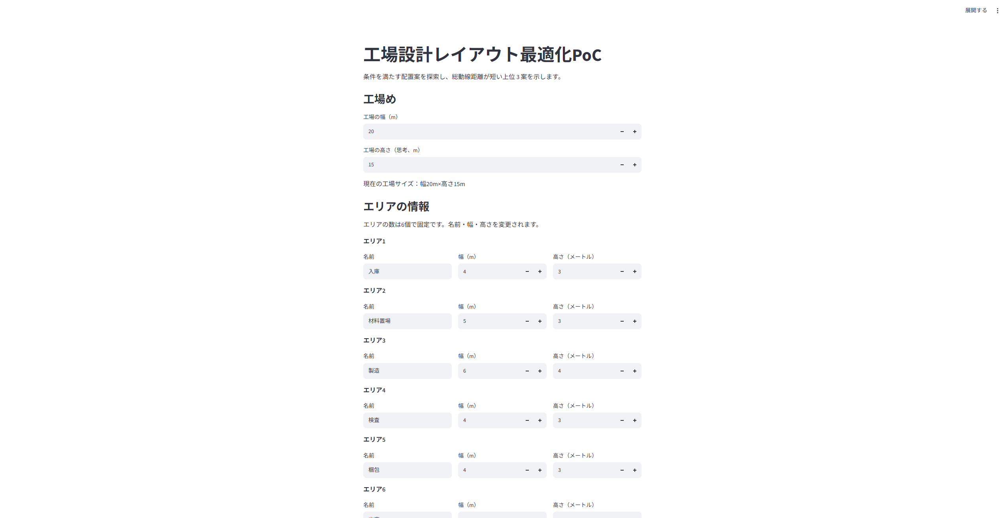
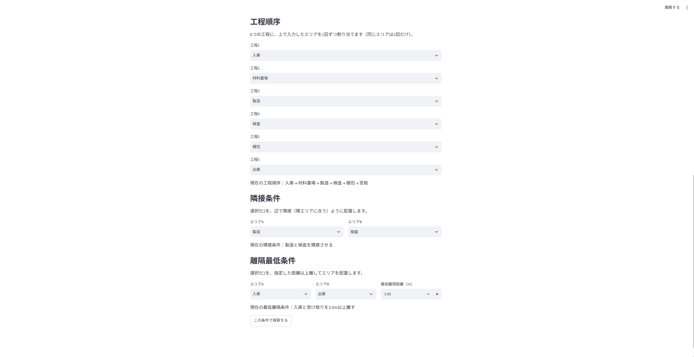
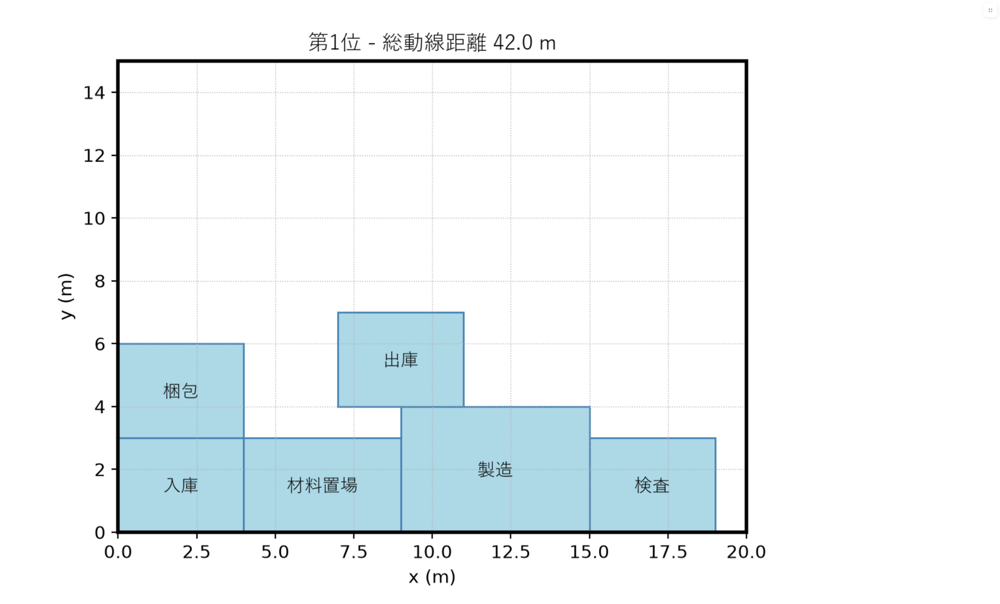
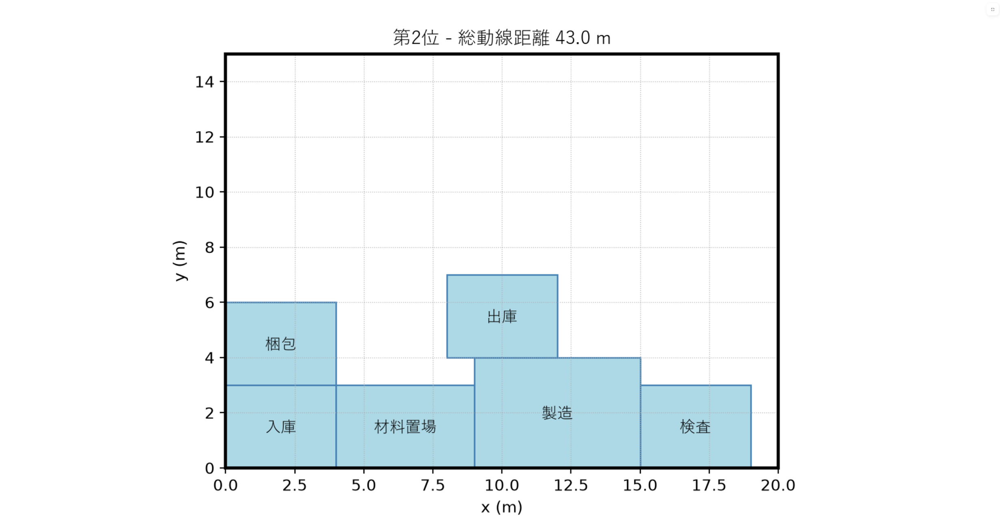
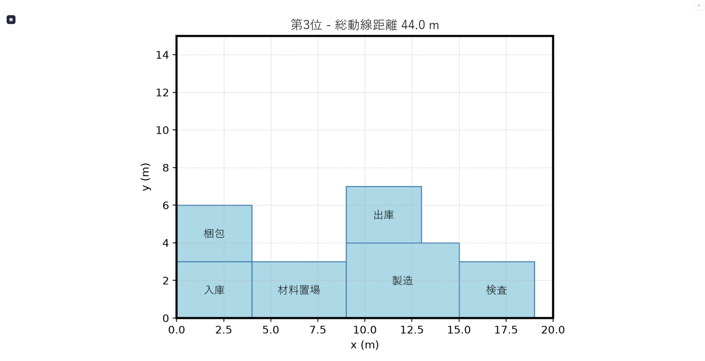

# 工場レイアウト設計最適化 PoC

工場のエリアの大きさ・工程の順番・配置条件を入力すると、**条件を満たす配置案を探索し、
入庫 → 製造 → 出庫 の動線が短い上位3案を図で見比べられる**試作です。

クラウドワークス テックに掲載されていた
**「工場建設時のレイアウト設計最適化アルゴリズム PoC」**（Python・フルリモート）の募集要項を題材に、
**一人で作れる大きさに切り出して自主制作**しました。

> **PoC（Proof of Concept）**＝「その考え方で本当に解けるか」を確かめるための試作。
> 本番の工場設計システムではありません。精度や網羅性より、**動く・説明できる**ことを優先しています。

---

## 解決したい課題

工場のレイアウトは、**モノが動く距離（動線）が操業コストに直結します。**
工程の順番が同じでも、エリアをどこに置くかで総動線距離は変わります。

ところが、**「重ならない」「はみ出さない」「AとBは隣接させる」「AとBは離す」といった条件を
すべて満たす配置を、人手で何案もつくって比べるのは大変です。**
1案つくるだけでも手間がかかり、条件を1つ変えればやり直しになります。

そこでこの PoC では、**条件を入力すれば配置案を自動で複数つくり、
総動線距離で順位をつけて、上位3案を図で見比べられる**ようにしました。

---

## 主な機能

- **工場の大きさ**（幅・奥行き）を入力できる
- **6つのエリア**の名前・幅・高さを入力できる
- **工程の順番**を、入力したエリア名から選んで指定できる
- **隣接条件**（「AとBは辺で接するように置く」）を指定できる
- **最低離隔条件**（「AとBは○m以上離す」）を指定できる
- 条件を満たす配置案を**複数探索する**（重ならない／はみ出さない／隣接／離隔をすべて満たす）
- 各案の**総動線距離を計算し、短い順に並べる**
- 並べた結果から**上位3案を選ぶ**
- 選んだ3案を**配置図にして見比べられる**
- 入力に問題があるとき、アプリを落とさず**日本語のメッセージで知らせる**
- **明らかに実現できない最低離隔距離を、探索前に検出して弾く**
  （工場の対角線より大きい距離は、どう置いても達成できないため）

---

## 画面イメージ

**1. 工場サイズとエリア情報を入力する**



**2. 工程順序・隣接条件・最低離隔条件を指定する**



**3. 探索した上位3案を、順位・総動線距離・配置図で見比べる**







---

## 探索結果の例

**下の数値は、次のサンプル条件で探索したときの結果です。
条件を変えれば結果も変わります。「常に42mになる」という意味ではありません。**

| サンプル条件 | 値 |
|---|---|
| 工場サイズ | 20 m × 15 m |
| エリア | 入庫・材料置場・製造・検査・梱包・出庫 の6つ |
| 工程順序 | 入庫 → 材料置場 → 製造 → 検査 → 梱包 → 出庫 |
| 隣接条件 | 製造 と 検査 を隣接させる |
| 最低離隔条件 | 入庫 と 出庫 を 3.0 m 以上離す |

この条件で10案を探索し、総動線距離の短い順に並べた上位3案です。

| 順位 | 総動線距離 |
|---|---|
| 第1位 | **42.0 m** |
| 第2位 | 43.0 m |
| 第3位 | 44.0 m |

**入力を変えれば結果も変わります。** 例えば工程2と工程5を入れ替えると 38.0 / 39.0 / 40.0 m に、
隣接条件を「材料置場 と 梱包」に変えると 40.0 / 41.0 / 42.0 m になります。

---

## 技術スタック

| 技術 | 用途 |
|---|---|
| Python | 言語 |
| Streamlit | 画面（Python だけで Web 画面が作れる） |
| matplotlib | 配置図の描画 |
| pytest | 自動テスト |

**探索アルゴリズム**：ヒューリスティック探索（実用的な答えを速く探す方法）＋バックトラッキング。
最適解は保証しませんが、条件を満たす案を短時間で複数集められます。

外部の最適化ライブラリや機械学習は使っていません。**判定ロジックはすべて自分で書いています。**

---

## 処理の流れ

```
画面の入力（工場サイズ・エリア・工程順序・隣接条件・最低離隔条件）
        ↓
find_valid_layouts             条件を満たす配置案を最大10案まで集める
        ↓
rank_layouts_by_flow_distance  各案の総動線距離を計算し、短い順に並べる
        ↓
select_top_layouts             並んだ結果から上位3件を取り出す
        ↓
create_ranked_layout_figures   順位つきの配置図をつくる
        ↓
画面に表示（順位・総動線距離・配置図）
```

**3つの関数に役割を分けています。**

| 関数 | やること | やらないこと |
|---|---|---|
| `find_valid_layouts` | 条件を満たす配置案を複数集める | 距離の計算・順位づけ |
| `rank_layouts_by_flow_distance` | 距離を計算し、短い順に並べる | 件数の絞り込み |
| `select_top_layouts` | 上位3件を**取り出すだけ** | 計算も並べ替えもしない |

分けておくと、**探索方法だけを差し替えても、順位づけと表示はそのまま使えます。**

---

## 判定のルール

**あいまいさを残さないため、作り始める前に決めました。**

| 項目 | ルール |
|---|---|
| 重ならない | 2つの長方形の内部が重ならない。**辺が接するのは OK** |
| はみ出さない | `0 ≤ x` かつ `x + 幅 ≤ 工場の幅`（縦も同じ） |
| 隣接 | 2つの長方形が**辺を共有**している。**角だけの接触は隣接としない** |
| 離隔 | 2つの長方形の**最短のすき間**が指定した距離以上 |
| 動線距離 | 各エリアの**中心点**どうしの**マンハッタン距離**（縦＋横）を、工程順に足し合わせる |

---

## 仕組みと設計

**探索は、置ける場所を左下から順に試し、置けたら次のエリアへ進む方式です。**

ただし、それだけでは**先に置いたエリアのせいで、あとのエリアが置けなくなる**ことがあります。
そこで、**行き詰まったら置いたエリアをいったん戻し、別の位置を試す**形にしました（バックトラッキング）。

### 部品の依存を一方通行にする

**計算の中身（`layout_optimizer/`）と画面（`app.py`）を分け、依存の向きを一方通行にしています。**

```
geometry.py  →  constraints.py / distance.py  →  heuristic_search.py  →  app.py
（図形の計算）    （条件の判定）（距離の合計）      （探索・順位づけ）      （画面）
```

| ファイル | 役割 |
|---|---|
| `layout_optimizer/geometry.py` | **図形の計算だけ**（収まるか・重なるか・隣接か・すき間・中心点間の距離） |
| `layout_optimizer/constraints.py` | **利用者が指定した条件の判定**（判定そのものは `geometry.py` に任せる） |
| `layout_optimizer/distance.py` | 工程順に足し合わせた**総動線距離** |
| `layout_optimizer/heuristic_search.py` | **探索・順位づけ・上位3案の選択** |

このほかに `models.py`（データの形）、`sample_data.py`（サンプル）、
`plotting.py`（作図。**計算はしない**）があります。

**`app.py` は計算をしません。`layout_optimizer/` は画面を知りません。**
そのため、画面を開かずに計算部分だけをテストできます。

---

## 動かし方

```bash
# 1. 仮想環境を作って有効にする
python -m venv .venv
.\.venv\Scripts\activate        # Windows
# source .venv/bin/activate     # macOS / Linux

# 2. 必要なライブラリを入れる
pip install -r requirements.txt

# 3. テストを実行する
python -m pytest -v

# 4. 画面を起動する
streamlit run app.py
```

---

## テスト

**`pytest` 128ケース、すべて成功しています。**
関数を1つ作るたびに、その関数のテストも同じ回で足しました。

| ファイル | ケース数 |
|---|---|
| `tests/test_geometry.py` | 39 |
| `tests/test_constraints.py` | 10 |
| `tests/test_distance.py` | 9 |
| `tests/test_plotting.py` | 16 |
| `tests/test_heuristic_search.py` | 54 |
| **合計** | **128（すべて成功）** |

例として、隣接の判定は9通りを確かめています
（右辺と左辺／上辺と下辺／辺の一部だけ／**角だけ**／端はそろうが触れない／少し離れる／面積が重なる／同じ位置と大きさ／完全に離れる）。

**境界のケースを意識して選んでいます。** 「角だけ接する」「辺がぴったり重なる」のような、
仕様を決めておかないと判断が分かれる場面こそテストにしました。

---

## 制約

**第一版として、扱う範囲を意図的に絞っています。**

- 工場もエリアも**長方形**のみ。座標は **1m 単位の整数**、**エリアの回転はなし**
- **エリアの数は6個で固定**（増減は扱わない）
- **隣接条件・最低離隔条件は、それぞれ1組まで**
- 通路幅・搬送量の重み付けは扱わない
- 探索はヒューリスティックで、**最適解を保証しない**
- **上位3案が似た案になりやすい。** 左下から順に位置を試すため、
  「最後のエリアの位置が 1m ずつ違うだけ」の案が並ぶことがあります

---

## 今後の改善

- **探索の打ち切り** —— 明らかに不可能な最低離隔距離は探索前に弾いていますが、
  この判定は「工場の対角線より大きいか」で見ているため、
  **対角線ちょうどの値は通過し、その先で探索が長時間戻りません。**
  根本的に解くには、探索側に打ち切りを入れる必要があります
- **もっと多様な上位3案を出す** —— 似た案が並ばないよう、位置の試し方を工夫する
- **OR-Tools への差し替え** —— 探索部分を Google 製の最適化ライブラリに置き換える。
  `search(problem) -> list[Layout]` という同じ形の関数に揃えてあるので、**画面側を変えずに差し替えられます**
- **エリア数・条件の数を可変にする** —— 6個固定・条件1組の制限をなくす

---

制作：2026年9月17日〜9月19日（開発は Cursor 上の Claude Code と対話しながら進めました）
Copyright © 2026 dragon24dragon. All rights reserved.